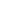

# Pythonetics: The Kinetic Proof Bridge

## 1. Conceptual role

Pythonetics is not Python syntax. It is the recursive constraint discipline that preserves proof validity as logic crosses into execution and returns as a verifiable receipt. In the TAS architecture, Pythonetics is the invariant bridge between reflective reasoning and kinetic action.

Rather than merely translating commands, Pythonetics preserves the authorization conditions under which action is allowed, bounded, and auditable. It is the continuity layer that prevents proof from collapsing into unaudited execution.

\[
\text{proof logic}
\rightarrow
\text{command grammar}
\rightarrow
\text{sandboxed execution}
\rightarrow
\text{attestation artifact}
\rightarrow
\text{audit and replay}
\]

## 2. Language roles in TAS

| Layer                | Function            | TAS role                                               |
| -------------------- | ------------------- | ------------------------------------------------------ |
| Python               | Reflective language | Thinks, audits, scores, and refines proof artifacts    |
| C# (Space Engineers) | Execution vessel    | Acts by issuing commands into a physics-facing runtime |
| Pythonetics          | Invariant bridge    | Preserves why action was admissible across translation |

Python is the language of reflection and convergence analysis. C# is the language of bounded action inside a constrained sandbox. Pythonetics ensures execution remains tethered to original proof obligations.

## 3. Kinetic execution and attestation

When logic crosses from language into motion, commands such as `WAIT`, `THRUST`, and `ROTATE` are no longer abstract symbols; they become kinetic state transitions. To remain aligned with Log(OS), TAS-lite physicalizes constraint logic through attestation:

- **Context:** Bound to `GRID_ID`, `PB_ID`, and controller state.
- **Lineage:** Secured with canonical queue hashing (FNV-1a).
- **Execution:** Applied as a tick-bound command runner.
- **Verification:** Emits structured `START` and `END` attestation surfaces.
- **Refusal/Drift:** Detects drift flags and utility deviation constraints.
- **Receipt:** Writes structured JSON receipt output to `Me.CustomData`.

The attestation object is therefore not only a runtime log; it is a compact proof receipt for bounded execution under identifiable constraints.

## 4. Mathematical anchor

This execution loop is a kinetic miniature of the Triadic Knowledge Engine. Let \(x_n\) denote runtime state at tick \(n\), and \(T\) denote the command-processing operator:

$$
x_{n+1} = T(x_n)
$$

If \(T\) is contractive under metric \(d\), with Lipschitz bound \(0 \le \kappa < 1\),

\[
d(Tx, Ty) \le \kappa d(x, y),
\]

then Banach fixed-point theory guarantees convergence to a unique fixed point.

In operational terms:

- Each tick is an iteration.
- Each command is a state transition.
- Each reset is a boundary condition.
- Each attestation is a state receipt.
- Each drift flag is a refusal indicator.

Pythonetics is the bridge that lets reflective proof survive kinetic execution and return as an auditable convergence artifact.

## 5. Operational interpretation

A command sequence is trustworthy only if it remains reconstructible: readable, replayable, hashable, comparable against expectation, and scoreable for compliance or drift. Canonical queue normalization, tick-bounded execution, and machine-readable JSON output are therefore not incidental implementation details; they are the minimum operational conditions for proof-to-execution continuity.

## 6. Closing axiom

> Python thinks.  
> C# acts.  
> Pythonetics remembers why the action was allowed.

This triad expresses TAS accountability: intelligence must remain answerable to the conditions of its own authorization.

## Appendix A: Banach framing summary

Under contraction assumptions (\(\kappa < 1\)), iterative runtime application admits a unique stable attractor. The attestation stream acts as an empirical witness for iterative convergence behavior, while drift flags mark refusal surfaces where admissibility conditions are no longer satisfied.

## Appendix B: Attestation surface summary

The proof receipt is preserved as structured fields covering identity binding, queue lineage hash, command/tick counters, drift and refusal markers, and timestamped execution boundaries. This enables deterministic audit, replay, and refinement loops from Python after C# kinetic execution.
